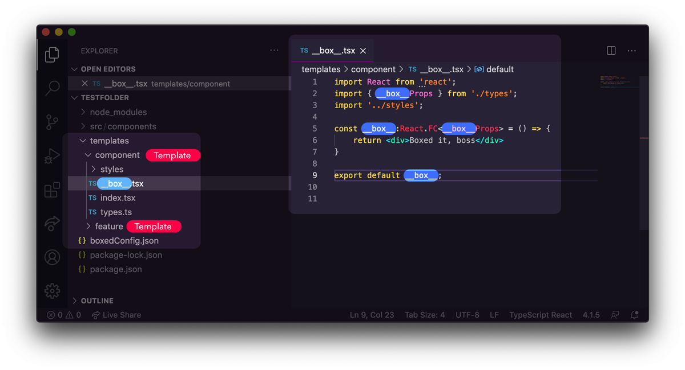

# boxed-components README

Boxed Components lets you create component templates called 'boxes'. These are full folder snippets that you can spawn instances of, set a replacement string in file names and file content to swap out when it's spawned, making scaffolding a new named component a breeze. You can have as many templates as you want. Stylish.

## Features

You create templates that have no name, instead they're called \_\_box_\_ wherever the name will be injected.

Here I'm creating a new component called Card. In my template, anywhere I want the name of the component to be (in this case the string 'Card', I write \__box__\). This can be done in file names and file content.

## Instructions

1. Create a templates folder, and inside this folder author a new component, including everything your component file structure usually needs. a Styles folder, an index.tsx, a ComponentName.tsx, a \_\_tests\_\_ folder, etc. The templates folder isn't critical, you may choose to have a template inside the src/components folder for instance. Your template src path is set in the config file (see 4.).

2. This component should be in essence a \_\_box\_\_.tsx component. Everywhere inside the file, replace where the component name should go with the string '\_\_box\_\_'.

Example: `__box__.tsx` looks like this.

    import React from 'react';
    import { __box__Props } from './types';
    import '../styles';
    
    const __box__:React.FC<__box__Props> = () => {
    	return 
This is the __box__ component.

    }
    
    export default __box__;

and the `./types` folder that is being imported looks like this

    export interface __box__Props {
    
    }

The \_\_box\_\_ string will work everywhere, for instance `__box__.scss`.

3. In order to spawn a new component, you will need a file in your root directory called `boxedConfig.json`.

In this json file you set your templates, including `src` and `dest` for each.

    {
        "templates": {
            "component" : {
                "src" : "templates/component",
                "dest" : "src/components"
            },
            "feature" : {
                "src" : "templates/feature",
                "dest" : "src/store/features"
            }
        }
    }

4. Finally, use this extension whenever you need to spawn a new boxed component by `CMD+Shift+P` and searching for __Boxed Components__.

## Release Notes

### 1.0.0

Initial release of Boxed Components

